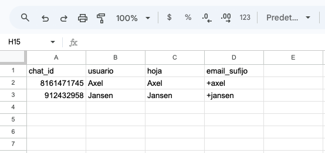
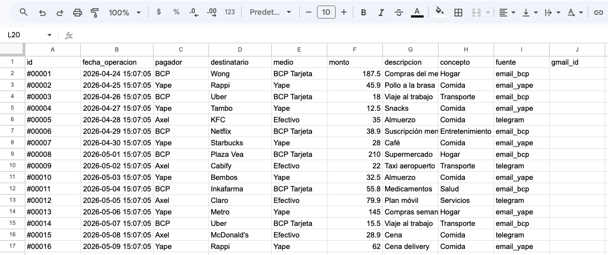

# GastosBot 🤖

Bot personal para el registro y consulta automática de gastos familiares. Funciona 24/7 sin servidor propio.

## ¿Qué hace?

- **Registra gastos automáticamente** desde correos bancarios (BCP, Yape, Interbank)
- **Acepta comandos en lenguaje natural** por Telegram (texto o voz)
- **Multi-usuario** — cada familiar tiene su propia hoja de registros
- **Dashboard visual** con gráficos interactivos (app Streamlit)

## Stack

| Componente | Tecnología |
|---|---|
| Backend | Google Apps Script |
| Base de datos | Google Spreadsheet |
| Mensajería | Telegram Bot API |
| IA (extracción de datos) | DeepSeek AI |
| IA (transcripción de voz) | Groq Whisper |
| Correos bancarios | Gmail API (nativa en GAS) |

## Comandos disponibles (Telegram)

Todos los comandos se envían en lenguaje natural, por ejemplo:

- *"Gasté 50 soles en almuerzo en efectivo"* → registra gasto en cash
- *"Muéstrame mis últimos 5 gastos"* → lista registros recientes
- *"¿Cuánto gasté esta semana?"* → total del rango
- *"¿Cuánto gasté en comida este mes?"* → total por categoría
- *"Elimina el gasto de ayer en Rappi"* → elimina por criterio
- *"Corrige el monto del gasto #42 a 80 soles"* → edita un campo

## Dashboard

App Streamlit con visualizaciones interactivas conectada al Spreadsheet en tiempo real:

- Gasto total por mes
- Distribución por concepto
- Gasto por medio de pago
- Evolución diaria
- Comparación entre familiares
- Top beneficiarios

## Estructura del proyecto

```
gastosbot/
├── Código.js             # Lógica principal (Google Apps Script)
├── appsscript.json       # Configuración del proyecto GAS
├── dashboard/
│   ├── app.py            # App Streamlit
│   └── requirements.txt  # Dependencias Python
└── .gitignore
```

---

## Antes de empezar — ¿Cómo vas a usarlo?

Responde estas preguntas antes de tocar cualquier archivo. Las respuestas definen qué valores debes colocar en la hoja `Config` y en el script.

### Paso 1 — ¿Uso personal o familiar?

- **Solo tú:** necesitarás una fila en la hoja `Config` y una sola hoja de registros.
- **Familiar o amigos:** una fila en `Config` y una hoja de registros por persona.

### Paso 2 — ¿Los correos bancarios llegarán a tu Gmail personal o a uno nuevo?

Los correos de notificación de tu banco o billetera digital llegan primero al correo vinculado con tu cuenta bancaria. Tienes dos opciones:

**Opción A — Usar tu Gmail personal (el ya vinculado al banco)**

1. No necesitas crear ningún correo adicional.
2. En `Código.js`, cambia `FORWARDING_EMAIL` a tu correo personal.
3. En la hoja `Config`, deja la columna `email_sufijo` vacía para tu usuario.

**Opción B — Usar un Gmail nuevo exclusivo para el bot**

Útil si quieres mantener separados los correos del bot de tu bandeja personal, o si varias personas usarán el bot.

1. Crea un Gmail nuevo (ej: `mis.gastos@gmail.com`).
2. Desde la **app de tu banco o billetera digital**, activa o verifica que estén habilitadas las notificaciones por correo. Estas llegarán al correo ya vinculado con tu cuenta bancaria (tu correo personal).
3. Desde tu **correo personal** (el vinculado al banco), configura el reenvío automático al correo nuevo:
   - Gmail → ⚙️ Configuración → Ver toda la configuración → **Reenvío y correo POP/IMAP** → Añadir una dirección de reenvío → ingresa el correo nuevo → confirma el código de verificación que llegará a ese correo.
4. En `Código.js`, cambia `FORWARDING_EMAIL` al correo nuevo (ej: `mis.gastos@gmail.com`).
5. Si son varios usuarios, cada familiar configura el reenvío desde su correo personal al mismo correo nuevo, usando la dirección con sufijo: `mis.gastos+sufijo@gmail.com` (ej: `mis.gastos+jansen@gmail.com`). Gmail entrega todos estos al mismo buzón del correo nuevo.

### Paso 3 — Rellenar la hoja Config

La pestaña `Config` del Spreadsheet debe tener una fila por cada usuario con los siguientes encabezados exactos:

| Columna | Descripción | Ejemplo (solo tú) | Ejemplo (familiar) |
|---|---|---|---|
| `chat_id` | ID de Telegram del usuario — obtenlo con [@userinfobot](https://t.me/userinfobot) | `123456789` | `987654321` |
| `usuario` | Nombre del usuario | `Axel` | `Jansen` |
| `hoja` | Nombre exacto de la pestaña de registros de ese usuario | `Axel` | `Jansen` |
| `email_sufijo` | Sufijo del correo de reenvío. Vacío si es el correo principal (Opción A o usuario base en Opción B) | *(vacío)* | `jansen` |

> Si solo eres tú, tendrás una sola fila con `email_sufijo` vacío.



---

## Setup técnico (Google Apps Script)

### 1. Requisitos
- Cuenta de Google
- [clasp](https://github.com/google/clasp) instalado (`npm install -g @google/clasp`)
- Bot de Telegram creado con [@BotFather](https://t.me/BotFather)
- API key de [DeepSeek](https://platform.deepseek.com/)
- API key de [Groq](https://console.groq.com/)

### 2. Clonar y subir el script
```bash
git clone https://github.com/aaccasanih-wq/gastosbot.git
cd gastosbot
clasp login
clasp create --type standalone --title "GastosBot"
clasp push
```

### 3. Cambiar el correo de destino

Al inicio de `Código.js` encontrarás esta variable:

```javascript
var FORWARDING_EMAIL = 'gastos.familia.hub@gmail.com';
```

Cámbiala al correo donde recibirás los reenvíos bancarios (el que definiste en el Paso 2 anterior).

### 4. Configurar Script Properties

En el editor de Apps Script → Configuración del proyecto → Propiedades del script:

| Propiedad | Valor |
|---|---|
| `SPREADSHEET_ID` | ID de tu Google Spreadsheet |
| `TELEGRAM_TOKEN` | Token del bot de Telegram |
| `DEEPSEEK_API_KEY` | API key de DeepSeek |
| `GROQ_API_KEY` | API key de Groq |

### 5. Crear el Spreadsheet

El archivo debe llamarse `Registro_de_Gastos` y contener:

- Una pestaña **`Config`** con los usuarios (ver Paso 3 arriba).
- Una pestaña por cada usuario, con el nombre exacto que pusiste en la columna `hoja` de Config.

Cada pestaña de usuario debe tener los siguientes encabezados en la fila 1:

| Columna | Descripción |
|---|---|
| `id` | ID único del registro (lo genera el script) |
| `fecha_operacion` | Fecha y hora de la operación (`YYYY-MM-DDTHH:MM:SS`) |
| `pagador` | Titular de la cuenta |
| `destinatario` | A quién fue el dinero |
| `medio` | Medio de pago: `Yape`, `Tarjeta Debito BCP`, `Tarjeta Credito BCP`, `Interbank`, `Efectivo` |
| `monto` | Monto en soles |
| `descripcion` | Nota del comprobante (puede quedar vacía) |
| `concepto` | Categoría: `comida`, `transporte`, `servicios`, `entretenimiento`, `salud`, `educacion`, `ropa`, `prestamos`, `pago de prestamos`, `tecnologia`, `hogar`, `otro` |
| `fuente` | Origen del registro: `email` o `telegram` |
| `gmail_id` | ID del correo bancario (lo usa el script para evitar duplicados) |



### 6. Activar triggers

En Apps Script → Activadores, crear dos triggers **cada 1 minuto**:
- `pollTelegram` — recibe mensajes de Telegram
- `checkEmails` — procesa correos bancarios

---

## Bancos soportados (Perú)
- BCP (`notificaciones@notificacionesbcp.com.pe`)
- Yape (`notificaciones@yape.pe`)
- Interbank (`servicioalcliente@netinterbank.com.pe`)

## Costo estimado
Menos de **$0.05 USD / mes** en uso normal familiar.
